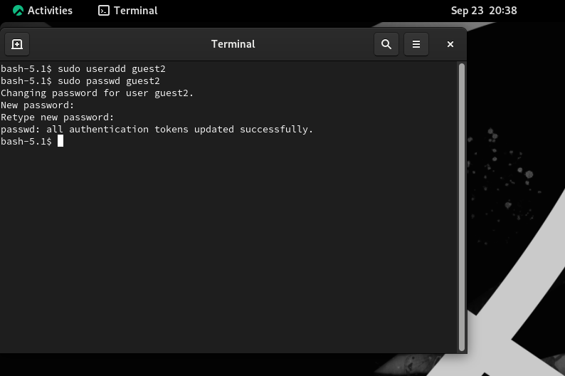
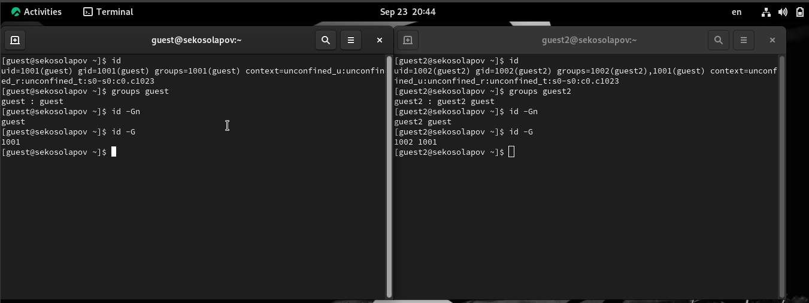
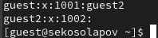
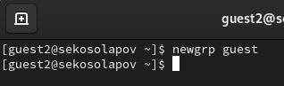
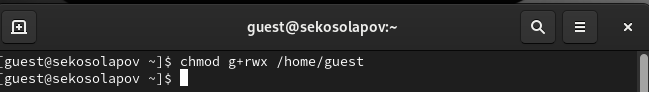
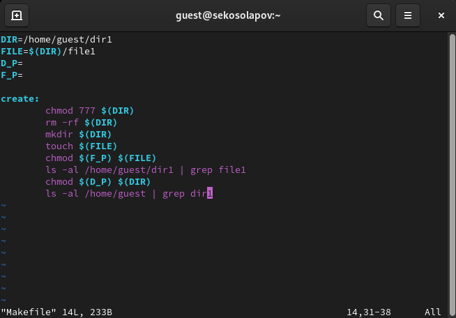
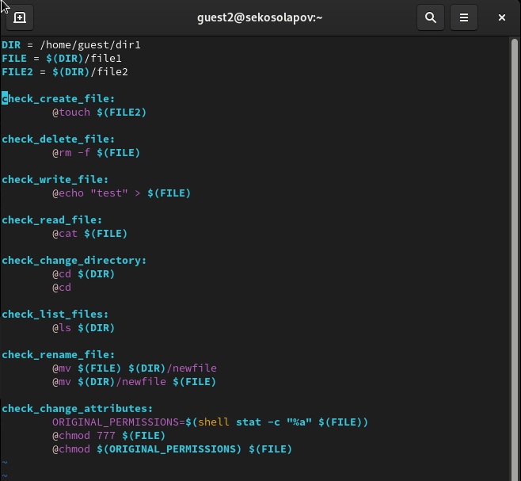
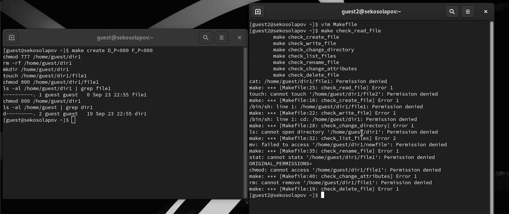
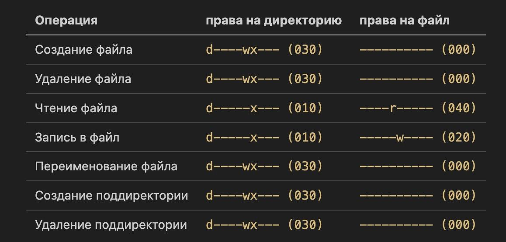

---
## Front matter
lang: ru-RU
title: Дискреционное разграничение прав в Linux. Основные атрибуты
author: |
	 Косолапов Степан \inst{1}

institute: |
	\inst{1}Российский Университет Дружбы Народов

date: 23 сентября, 2023, Москва, Россия

## Formatting
mainfont: Calibri
romanfont: Calibri
sansfont: Calibri
monofont: Calibri
toc: false
slide_level: 2
theme: metropolis
header-includes:
 - \metroset{progressbar=frametitle,sectionpage=progressbar,numbering=fraction}
 - '\makeatletter'
 - '\beamer@ignorenonframefalse'
 - '\makeatother'
aspectratio: 43
section-titles: true

---

# Цели и задачи работы

## Цель лабораторной работы

Получение практических навыков работы в консоли с атрибутами файлов для групп пользователей.

# Процесс выполнения лабораторной работы

## Создаём нового пользователя

## Определяем UID и группу двух пользователей

## Файл с данными о группах

## Регистрация в группе

## Атрибуты директории

## Makefile 1

## Makefile 2

## Определяем права для группы

## Заполнение таблицы

# Выводы по проделанной работе

## Вывод

В ходе выполнения работы, мы смогли приобрести практические навыки работы в консоли с атрибутами файлов для групп пользователей.
