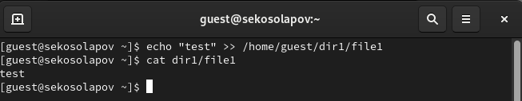
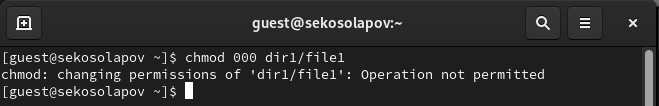
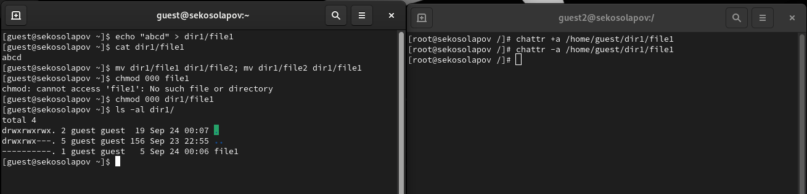

---
## Front matter
lang: ru-RU
title: Дискреционное разграничение прав в Linux. Расширенные атрибуты
author: |
	 Косолапов Степан \inst{1}

institute: |
	\inst{1}Российский Университет Дружбы Народов

date: 30 сентября, 2023, Москва, Россия

## Formatting
mainfont: Calibri
romanfont: Calibri
sansfont: Calibri
monofont: Calibri
toc: false
slide_level: 2
theme: metropolis
header-includes:
 - \metroset{progressbar=frametitle,sectionpage=progressbar,numbering=fraction}
 - '\makeatletter'
 - '\beamer@ignorenonframefalse'
 - '\makeatother'
aspectratio: 43
section-titles: true

---

# Цели и задачи работы

## Цель лабораторной работы

Получение практических навыков работы в консоли с расширенными атрибутами файлов.

# Процесс выполнения лабораторной работы

## Расширенные атрибуты 

## Установка расширенного атрибута от имени пользователя

## Установка расширенного атрибута от имени администратора

## Дозапись при расширенном атрибуте a

## Перезапись при расширенном атрибуте a

## Смена прав на файл при расширенном атрибуте a

## Действия без расширенных атрибутов

## Расширенный атрибут i

# Выводы по проделанной работе

## Вывод

В результате выполнения работы вы повысили свои навыки использования интерфейса командой строки (CLI), познакомились на примерах с тем,
как используются основные и расширенные атрибуты при разграничении
доступа. Имели возможность связать теорию дискреционного разделения
доступа (дискреционная политика безопасности) с её реализацией на практике в ОС Linux. Составили наглядные таблицы, поясняющие какие операции возможны при тех или иных установленных правах. Опробовали действие на практике расширенных атрибутов «а» и «i».
