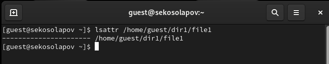
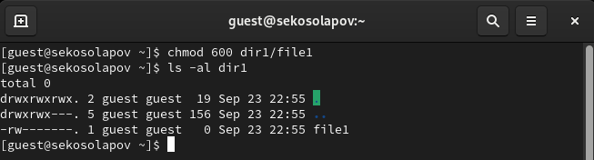
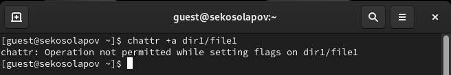
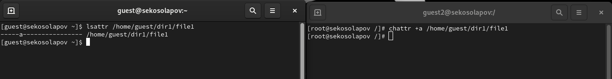
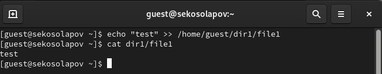
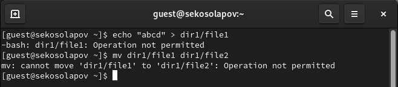
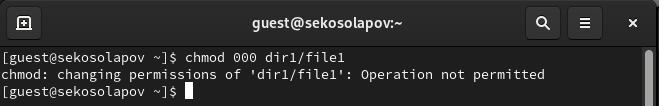
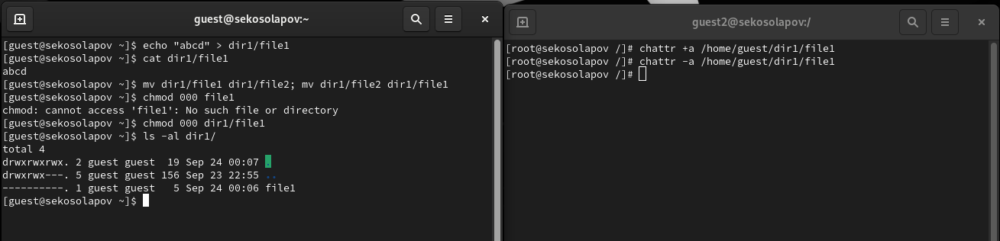
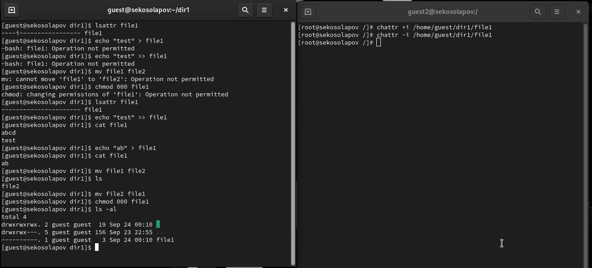

---
# Front matter
title: "Отчёт по лабораторной работе №4"
subtitle: "Дискреционное разграничение прав в Linux. Расширенные атрибуты"
author: "Косолапов Степан Эдуардович НПИбд-01-20"

# Generic otions
lang: ru-RU
toc-title: "Содержание"

# Pdf output format
toc: true # Table of contents
toc_depth: 2
lof: true # List of figures
lot: true # List of tables
fontsize: 12pt
linestretch: 1.5
papersize: a4
documentclass: scrreprt
## I18n
polyglossia-lang:
  name: russian
  options:
	- spelling=modern
	- babelshorthands=true
polyglossia-otherlangs:
  name: english
### Fonts
mainfont: Calibri
romanfont: Calibri
sansfont: Calibri
monofont: Calibri
mainfontoptions: Ligatures=TeX
romanfontoptions: Ligatures=TeX
sansfontoptions: Ligatures=TeX,Scale=MatchLowercase
monofontoptions: Scale=MatchLowercase,Scale=0.9
## Biblatex
biblatex: true
biblio-style: "gost-numeric"
biblatexoptions:
  - parentracker=true
  - backend=biber
  - hyperref=auto
  - language=auto
  - autolang=other*
  - citestyle=gost-numeric
## Misc options
indent: true
header-includes:
  - \linepenalty=10 # the penalty added to the badness of each line within a paragraph (no associated penalty node) Increasing the value makes tex try to have fewer lines in the paragraph.
  - \interlinepenalty=0 # value of the penalty (node) added after each line of a paragraph.
  - \hyphenpenalty=50 # the penalty for line breaking at an automatically inserted hyphen
  - \exhyphenpenalty=50 # the penalty for line breaking at an explicit hyphen
  - \binoppenalty=700 # the penalty for breaking a line at a binary operator
  - \relpenalty=500 # the penalty for breaking a line at a relation
  - \clubpenalty=150 # extra penalty for breaking after first line of a paragraph
  - \widowpenalty=150 # extra penalty for breaking before last line of a paragraph
  - \displaywidowpenalty=50 # extra penalty for breaking before last line before a display math
  - \brokenpenalty=100 # extra penalty for page breaking after a hyphenated line
  - \predisplaypenalty=10000 # penalty for breaking before a display
  - \postdisplaypenalty=0 # penalty for breaking after a display
  - \floatingpenalty = 20000 # penalty for splitting an insertion (can only be split footnote in standard LaTeX)
  - \raggedbottom # or \flushbottom
  - \usepackage{float} # keep figures where there are in the text
  - \floatplacement{figure}{H} # keep figures where there are in the text
---

# Цель работы

Получение практических навыков работы в консоли с расширенными атрибутами файлов

# Выполнение работы

1. От имени пользователя guest определяем расширенные атрибуты файла
/home/guest/dir1/file1 командой lsattr /home/guest/dir1/file1

2. Устанавливаем командой chmod 600 file1 на файл file1 права, разрешающие чтение и запись для владельца файла.

3. Пробуем установить на файл /home/guest/dir1/file1 расширенный атрибут a от имени пользователя guest:
chattr +a /home/guest/dir1/file1
В ответ получаем отказ от выполнения операции.

4. Пробуем установить расширенный атрибут a на файл /home/guest/dir1/file1 от имени суперпользователя:
chattr +a /home/guest/dir1/file1, а так же
От пользователя guest проверяем правильность установления атрибута:
lsattr /home/guest/dir1/file1

6. Выполняем дозапись в файл file1 слова «test» командой
echo "test" /home/guest/dir1/file1
После этого выполняем чтение файла file1 командой
cat /home/guest/dir1/file1
Видим, что слово test было успешно записано в file1.

7. Пробуем удалить файл file1 либо стереть имеющуюся в нём информацию командой
echo "abcd" > /home/guest/dirl/file1
Пробуем переименовать файл.

8. Пробуем с помощью команды
chmod 000 file1
установить на файл file1 права, запрещающие чтение и запись для владельца файла. Как видим, удалось это сделать.

9. Снимаем расширенный атрибут a с файла /home/guest/dirl/file1 от
имени суперпользователя командой
chattr -a /home/guest/dir1/file1
Повторяем операции, которые ранее не удавалось выполнить. Видим, что теперь все действия стали доступны.

10. Повторяем действия по шагам, заменив атрибут «a» атрибутом «i».
Не удалось ничего сделать с файлом, в том числе и дозаписать информацию в файл. Без этого атрибута все действия сделать получается.

# Выводы

В результате выполнения работы вы повысили свои навыки использования интерфейса командой строки (CLI), познакомились на примерах с тем,
как используются основные и расширенные атрибуты при разграничении
доступа. Имели возможность связать теорию дискреционного разделения
доступа (дискреционная политика безопасности) с её реализацией на практике в ОС Linux. Составили наглядные таблицы, поясняющие какие операции возможны при тех или иных установленных правах. Опробовали действие на практике расширенных атрибутов «а» и «i».
