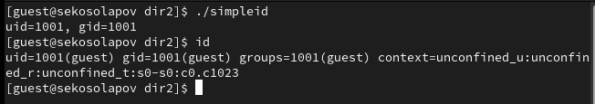
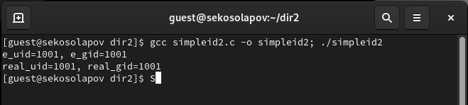
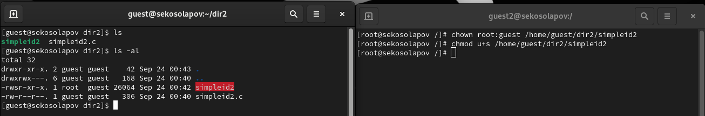
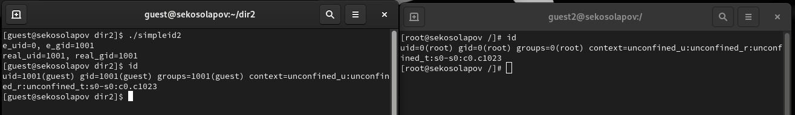
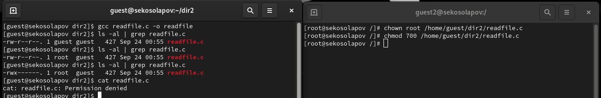
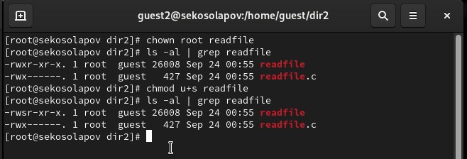
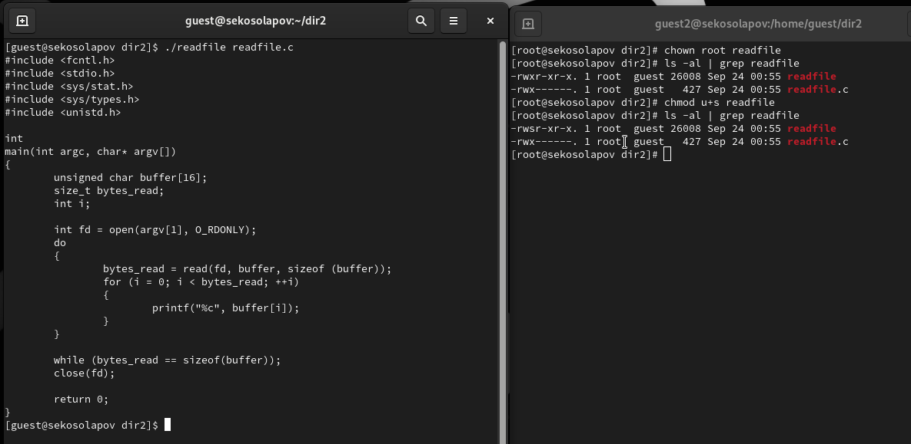
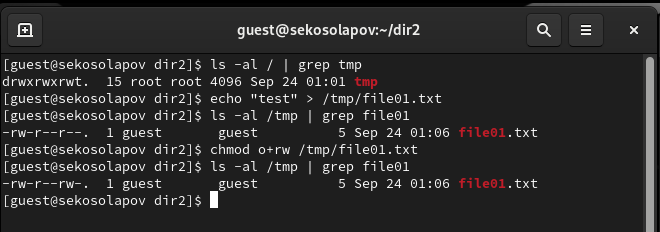

---
## Front matter
lang: ru-RU
title: "Дискреционное разграничение прав в Linux. Исследование влияния дополнительных атрибутов"
author: |
	 Косолапов Степан \inst{1}

institute: |
	\inst{1}Российский Университет Дружбы Народов

date: 7 октября, 2023, Москва, Россия

## Formatting
mainfont: Calibri
romanfont: Calibri
sansfont: Calibri
monofont: Calibri
toc: false
slide_level: 2
theme: metropolis
header-includes:
 - \metroset{progressbar=frametitle,sectionpage=progressbar,numbering=fraction}
 - '\makeatletter'
 - '\beamer@ignorenonframefalse'
 - '\makeatother'
aspectratio: 43
section-titles: true

---

# Цели и задачи работы

## Цель лабораторной работы

Изучение механизмов изменения идентификаторов, применения
SetUID- и Sticky-битов. Получение практических навыков работы в консоли с дополнительными атрибутами. Рассмотрение работы механизма
смены идентификатора процессов пользователей, а также влияние бита
Sticky на запись и удаление файлов.

# Процесс выполнения лабораторной работы

## Файл simpleid 

## Работа файла simpleid 

## Файл simpleid2

## Установка setuid бита

## Выполнение файла simpleid2 с битом setuid

## Файл readfile.c

## Установка прав на файл readfile.c только для root

## Установка setuid бита на файл readfile

## чтение readfile.c с помощью readfile с установленным setuid битом

## Создание файла в sticky директории

## Операции над файлом в sticky директории

## Операции над файлом в директории без sticky

# Выводы по проделанной работе

## Вывод

В данной работе мы изучили атрибуты sticky, и биты setgid и setuid и их влияние на различные аспекты работы системы.
