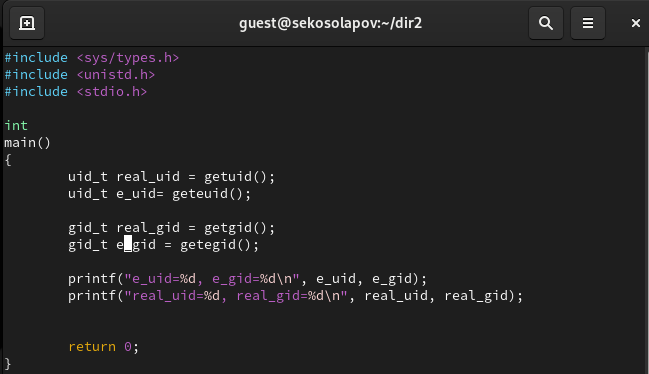

---
# Front matter
title: "Отчёт по лабораторной работе №5"
subtitle: "Дискреционное разграничение прав в Linux. Исследование влияния дополнительных атрибутов"
author: "Косолапов Степан Эдуардович НПИбд-01-20"

# Generic otions
lang: ru-RU
toc-title: "Содержание"

# Pdf output format
toc: true # Table of contents
toc_depth: 2
lof: true # List of figures
lot: true # List of tables
fontsize: 12pt
linestretch: 1.5
papersize: a4
documentclass: scrreprt
## I18n
polyglossia-lang:
  name: russian
  options:
	- spelling=modern
	- babelshorthands=true
polyglossia-otherlangs:
  name: english
### Fonts
mainfont: Calibri
romanfont: Calibri
sansfont: Calibri
monofont: Calibri
mainfontoptions: Ligatures=TeX
romanfontoptions: Ligatures=TeX
sansfontoptions: Ligatures=TeX,Scale=MatchLowercase
monofontoptions: Scale=MatchLowercase,Scale=0.9
## Biblatex
biblatex: true
biblio-style: "gost-numeric"
biblatexoptions:
  - parentracker=true
  - backend=biber
  - hyperref=auto
  - language=auto
  - autolang=other*
  - citestyle=gost-numeric
## Misc options
indent: true
header-includes:
  - \linepenalty=10 # the penalty added to the badness of each line within a paragraph (no associated penalty node) Increasing the value makes tex try to have fewer lines in the paragraph.
  - \interlinepenalty=0 # value of the penalty (node) added after each line of a paragraph.
  - \hyphenpenalty=50 # the penalty for line breaking at an automatically inserted hyphen
  - \exhyphenpenalty=50 # the penalty for line breaking at an explicit hyphen
  - \binoppenalty=700 # the penalty for breaking a line at a binary operator
  - \relpenalty=500 # the penalty for breaking a line at a relation
  - \clubpenalty=150 # extra penalty for breaking after first line of a paragraph
  - \widowpenalty=150 # extra penalty for breaking before last line of a paragraph
  - \displaywidowpenalty=50 # extra penalty for breaking before last line before a display math
  - \brokenpenalty=100 # extra penalty for page breaking after a hyphenated line
  - \predisplaypenalty=10000 # penalty for breaking before a display
  - \postdisplaypenalty=0 # penalty for breaking after a display
  - \floatingpenalty = 20000 # penalty for splitting an insertion (can only be split footnote in standard LaTeX)
  - \raggedbottom # or \flushbottom
  - \usepackage{float} # keep figures where there are in the text
  - \floatplacement{figure}{H} # keep figures where there are in the text
---

# Цель работы

Изучение механизмов изменения идентификаторов, применения
SetUID- и Sticky-битов. Получение практических навыков работы в консоли с дополнительными атрибутами. Рассмотрение работы механизма
смены идентификатора процессов пользователей, а также влияние бита
Sticky на запись и удаление файлов.

# Выполнение работы

1. Входим в систему от имени пользователя guest. Создаем программу simpleid.c:

2. Компилируем программу и убеждаемся, что файл программы создан.

3. Выполняем программу simpleid и выполняем системную программу id. Видим, что айдишники показываются такие же, но id показывает более расширеную информацию.

4. Усложняем программу, добавив вывод действительных идентификаторов.
Получившуюся программу называем simpleid2.c.

5. Компилируем и запускаем simpleid2.c.

6. От имени суперпользователя выполняем команды:
chown root:guest /home/guest/simpleid2
chmod u+s /home/guest/simpleid2 

7. Выполняем проверку правильности установки новых атрибутов и смены
владельца файла simpleid2

8. Запускаем программы simpleid2 и id. Видим, что при выполнении файла simpleid2 он берет id владельца.

9. Создаём программу readfile.c:

10. Компилируем ее командой:
gcc readfile.c -o readfile

11. Меняем владельца у файла readfile.c на root и выделяем права на чтение только для владельца.  Проверяем, что пользователь guest не может прочитать файл readfile.c.

12. Меняем у программы readfile владельца на root и устанавливаем SetUID-бит.

13. Проверяем, может ли программа readfile прочитать файл readfile.c. Видим, что программа может прочитать файл, потому что установлен SetUID бит, который позволяет программе при запуске получать права своего владельца, которым установлен root.

14. Проверяем, может ли программа readfile прочитать файл /etc/shadow.
Ситуация аналогичная предыдущему пункту. Мы можем прочитать этот файл, потому что у root есть к нему доступ на чтение.

15. Выясняем, установлен ли атрибут Sticky на директории /tmp.
Видим, что атрибут установлен (атрибут t).
От имени пользователя guest создаём file01.txt в директории /tmp
со словом test.
Смотрим атрибуты у только что созданного файла и разрешаем чтение и запись для категории пользователей «все остальные».

На самом деле, тут у пользователя guest2 не будет прав, потому что он находится в группе владельца файла и нам нужно добавить права на чтение для группы, а не для всех остальных.

chmod g+rw /tmp/file01.txt

16. От пользователя guest2 пробуем выполнить привычные опреации с файлом /tmp/file01.txt.
У нас получлось выполнить - чтение, дозапись, перезапись. Не получилось сделать удаление файла. Как раз из-за установленного на директории tmp атрибута tmp.

17. От имени суперпользователя убираем атрибут sticky.

18. Пробуем повторить операции без атрибтуа sticky у директории tmp.
Теперь мы можем выполнять все операции, которые разрешены для группы владельца файла, в нашем случае это дозапись, перезапись, чтение и удаление файла.

19. В конце возвращаем атрибут sticky директории tmp.

# Выводы

В данной работе мы изучили атрибуты sticky, и биты setgid и setuid и их влияние на различные аспекты работы системы. Атрибут sticky, применяемый к директориям, позволяет ограничить доступ к файлам в них, предотвращая удаление или переименование файлов другими пользователями. Бит setgid позволяет устанавливать группу-владельца для новых файлов, созданных в директории, что может быть полезно для обеспечения совместного доступа к файлам между пользователями. Бит setuid, с другой стороны, позволяет запускать исполняемые файлы с привилегиями владельца файла, что может быть полезно для выполнения определенных задач, требующих повышенных привилегий.