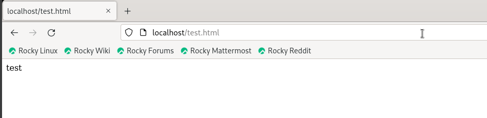
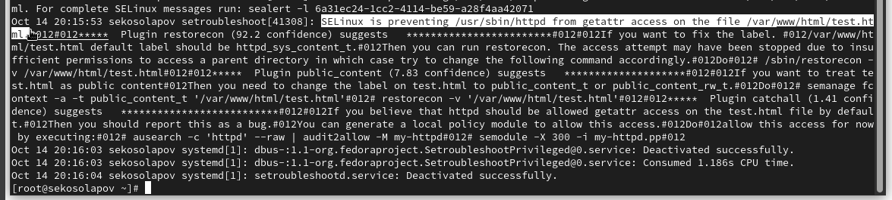

---
## Front matter
lang: ru-RU
title: "Мандатное разграничение прав в Linux"
author: |
	 Косолапов Степан \inst{1}

institute: |
	\inst{1}Российский Университет Дружбы Народов

date: 14 октября, 2023, Москва, Россия

## Formatting
mainfont: Calibri
romanfont: Calibri
sansfont: Calibri
monofont: Calibri
toc: false
slide_level: 2
theme: metropolis
header-includes:
 - \metroset{progressbar=frametitle,sectionpage=progressbar,numbering=fraction}
 - '\makeatletter'
 - '\beamer@ignorenonframefalse'
 - '\makeatother'
aspectratio: 43
section-titles: true

---

# Цели и задачи работы

## Цель лабораторной работы

Развить навыки администрирования ОС Linux. Получить первое практическое знакомство с технологией SELinux.
Проверить работу SELinx на практике совместно с веб-сервером Apache.

# Процесс выполнения лабораторной работы

## getenforce и sestatus

## Контекст безопасности процессов httpd

## Cтатистика по политике

## Контекст файлов и директорий

## Создание тестового html файла

## Контекст созданных файлов

## Проверка доступа

## Смена контекста

## Ошбики при доступе к файлу с изменённым контекстом

## Прослушивание порта не в http_port_t

# Выводы по проделанной работе

## Вывод

В данной работе мы развили навыки администрирования ОС Linux. Получили первое практическое знакомство с технологией SELinux.
Проверили работу SELinx на практике совместно с веб-сервером Apache.
