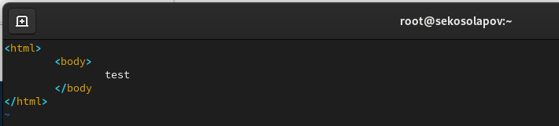

---
# Front matter
title: "Отчёт по лабораторной работе №6"
subtitle: "Мандатное разграничение прав в Linux"
author: "Косолапов Степан Эдуардович НПИбд-01-20"

# Generic otions
lang: ru-RU
toc-title: "Содержание"

# Pdf output format
toc: true # Table of contents
toc_depth: 2
lof: true # List of figures
lot: true # List of tables
fontsize: 12pt
linestretch: 1.5
papersize: a4
documentclass: scrreprt
## I18n
polyglossia-lang:
  name: russian
  options:
	- spelling=modern
	- babelshorthands=true
polyglossia-otherlangs:
  name: english
### Fonts
mainfont: Calibri
romanfont: Calibri
sansfont: Calibri
monofont: Calibri
mainfontoptions: Ligatures=TeX
romanfontoptions: Ligatures=TeX
sansfontoptions: Ligatures=TeX,Scale=MatchLowercase
monofontoptions: Scale=MatchLowercase,Scale=0.9
## Biblatex
biblatex: true
biblio-style: "gost-numeric"
biblatexoptions:
  - parentracker=true
  - backend=biber
  - hyperref=auto
  - language=auto
  - autolang=other*
  - citestyle=gost-numeric
## Misc options
indent: true
header-includes:
  - \linepenalty=10 # the penalty added to the badness of each line within a paragraph (no associated penalty node) Increasing the value makes tex try to have fewer lines in the paragraph.
  - \interlinepenalty=0 # value of the penalty (node) added after each line of a paragraph.
  - \hyphenpenalty=50 # the penalty for line breaking at an automatically inserted hyphen
  - \exhyphenpenalty=50 # the penalty for line breaking at an explicit hyphen
  - \binoppenalty=700 # the penalty for breaking a line at a binary operator
  - \relpenalty=500 # the penalty for breaking a line at a relation
  - \clubpenalty=150 # extra penalty for breaking after first line of a paragraph
  - \widowpenalty=150 # extra penalty for breaking before last line of a paragraph
  - \displaywidowpenalty=50 # extra penalty for breaking before last line before a display math
  - \brokenpenalty=100 # extra penalty for page breaking after a hyphenated line
  - \predisplaypenalty=10000 # penalty for breaking before a display
  - \postdisplaypenalty=0 # penalty for breaking after a display
  - \floatingpenalty = 20000 # penalty for splitting an insertion (can only be split footnote in standard LaTeX)
  - \raggedbottom # or \flushbottom
  - \usepackage{float} # keep figures where there are in the text
  - \floatplacement{figure}{H} # keep figures where there are in the text
---

# Цель работы

Развить навыки администрирования ОС Linux. Получить первое практическое знакомство с технологией SELinux.
Проверить работу SELinx на практике совместно с веб-сервером Apache.

# Выполнение работы

1. Войдите в систему с полученными учётными данными и убедитесь, что
SELinux работает в режиме enforcing политики targeted с помощью команд getenforce и sestatus.

2. Обращаемся с помощью браузера к веб-серверу, запущенному на компьютере, и видим, что сервер работает

3. Находим веб-сервер Apache в списке процессов, определяем его контекст безопасности - system_u:system_r:httpd_t:s0

4. Смотрим текущее состояние переключателей SELinux для Apache с помощью команды
sestatus -b | grep httpd

5. Смотрим статистику по политике с помощью команды seinfo. Количесвто пользователей - 8, ролей - 14, типов - 5100.

6. Определяем тип файлов и поддиректорий, находящихся в директории
/var/www, с помощью команды
ls -lZ /var/www - это типы httpd_sys_script_exec_t для cgi-bin b httpd_sys_content_t для html
7. Файлов в директории /var/www/html пока что нет.
8. Определяем круг пользователей, которым разрешено создание файлов в
директории /var/www/html с помощью той же команды ls, видим, что доступ на создание есть только у root.

9. Создаём от имени суперпользователя html-файл
/var/www/html/test.html

10. Проверяем контекст созданного нами файла - unconfined_u:object_r:httpd_sys_content_t:s0 - это контекст,
присваиваемый по умолчанию вновь созданным файлам в директории
/var/www/html.

11. Обращаемся к файлу через веб-сервер, введя в браузере адрес
http://127.0.0.1/test.html. Файл успешно отображён.

12. Изучить справку man httpd_selinux у нас не получилось, т.к такой справки не было обнаружено, поэтому обратились в интернет за этой справкой.

13. Изменяем контекст файла /var/www/html/test.html с
httpd_sys_content_t на любой другой, к которому процесс httpd не
должен иметь доступа, например, на samba_share_t:
chcon -t samba_share_t /var/www/html/test.html
ls -Z /var/www/html/test.html

14. Пробуем ещё раз получить доступ к файлу через веб-сервер, введя в браузере адрес http://127.0.0.1/test.html. Мы получаем
сообщение об ошибке:
Forbidden
You don't have permission to access this resource.

15. В данной ситуации у сервиса httpd не было доступа до файла из-за изменённого контекста.

Смотрим логи и видим, что действительно не было доступа у самого процесса до файла test.html

16. Пробуем запустить веб-сервер Apache на прослушивание ТСР-порта 81. Для этого в файле /etc/httpd/conf/httpd.conf находим строчку Listen 80 и
заменяем её на Listen 81.

17. Выполняем перезапуск веб-сервера Apache. Сбоя не произошло, т.к у нас уже был добавлен порт 81 в http_port_t.

18. Анализируем лог-файлы:
tail -nl /var/log/messages, и видим, что проблем не возникло. После просмотра semanage port -l | grep http_port_t, замечаем, что 81 порт уже добавлен. 

19. Пробуем провести все действия с портом 82. Добавляем его в /etc/httpd/conf/httpd.conf b и перезапускаем httpd сервис. Видим ошибку, все из-за того, то не добавлен порт в http_port_t.
Добавляем командой semanage port -a -t http_port_t -p tcp 82. После этого пробуем перезапустить httpd и все проходит на этот раз без ошибок.

Возвращаем контекст файлу test.html и у нас получается доступиться теперь к этому файлу, все работает.

20. Удаляем файл test.html и удаляем связь порта 82 из http_port_t.

# Выводы

В данной работе мы развили навыки администрирования ОС Linux. Получили первое практическое знакомство с технологией SELinux.
Проверили работу SELinx на практике совместно с веб-сервером Apache.
